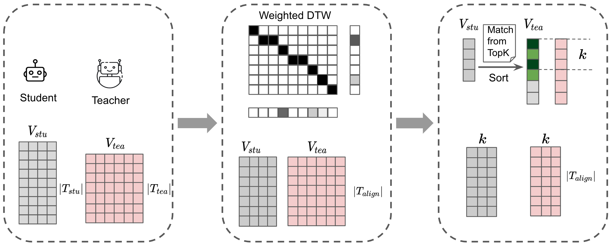

# CDM
This repository contains the source code for our paper [Enhancing Cross-Tokenizer Knowledge Distillation with Contextual Dynamical Mapping](https://arxiv.org/abs/2502.11104).

## Overview
We propose CDM, a cross-tokenizer distillation framework that dynamically optimizes sequence and vocabulary alignment using contextual information, demonstrating superior performance across three pairs of teacher-student models. The evaluation compasses three tasks, including instruction-following, code generation, and math.



*Figure 1: Overview of our proposed model distillation framework.*
## Quick Start

### Dependencies
- Python 3.8.14
- accelerate 0.34.2
- deepspeed 0.15.2 
- torch-npu 2.2.0 
- transformers  4.45.2
- rouge-score 0.1.2
- numpy 1.24.4 

### Installation
```bash
pip3 install -r requirements.txt
```
### Directory Structure
```
.
├── config # Configuration file for deepspeed
│   └── deepspeed_config.json
├── data # Post-processed training data (contains 50 examples)
│   ├── code_tuning.sample.json
│   ├── dolly_train.sample.json
│   └── math_tuning.sample.json
├── get_vocab_mapper # Scripts for preparing the vocabulary mappers
│   ├── get_em_mapper.py
│   ├── get_MinED_mapper.py
│   └── get_prefixEM_mapper.py
├── modeling # Implementations of CDM and all of the baselines
│   ├── run_clm_distill_CDM.py
│   ├── run_clm_llms_fkd.py
│   ├── run_clm_llms_rkd.py
│   ├── run_clm_MinED.py
│   ├── run_clm_sft.py
│   └── run_clm_uld.py
├── script_eval # Evaluation Scripts for the three task
│   ├── eval_code_task.sh
│   ├── eval_dolly.sh
│   └── eval_math.sh
├── script_train
│    └── phi-qwen # Example training scripts for Phi and Qwen, directly change the model name to train other models
├── README.md              # This file
└── requirements.txt       # Dependencies
```


### Data Preparation
- training data: We prepare the data from [Dolly](https://huggingface.co/datasets/databricks/databricks-dolly-15k), [CodeM](https://github.com/NL2Code/CodeM), [GSM-8k](https://huggingface.co/datasets/openai/gsm8k) to the instruction-following format, and the data can be found at xxx, which can be used directly in the scripts.
- vocabulary mapping for Exact Match (EM) or MinED or PrefixED. In the scripts we provide are for Qwen and Phi series, and for other teacher/student model pairs the correspondent model directory should be assigned in the scripts.

### Triaining
Chose the setting you want. For example, if you want to test our CDM method, replace the ${work_dir} to your own path then run:
```bash
bash script_train/phi-qwen/train_kd_a100_phi_qwen_CDM.sh
```


### Evaluation
For instruction following tasks, we follow the evaluation in [DSKD](https://github.com/songmzhang/DSKD). Pull the reposity to your local directory, and replace the script path in the follwing bash, then run the bash.
```bash
script_eval/eval_instFollow.sh
```

For code generation tasks, we use [EvalPlus](https://github.com/evalplus/evalplus). After git+install the reposity, run:
```bash
script_eval/eval_code.sh
```

For the mathematical task GSM-8K, we use [lm-evaluation-harness](https://github.com/EleutherAI/lm-evaluation-harness). After git+install the reposity, run:
```bash
script_eval/eval_math.sh
```

## Results

*Figure 2: Main results of comparing CDM and the baseline models, and the blod text means the best performance in comparable cross-tokenizer distillation settings. The table is divided into three sections, each labeled with the student models used in the respective distillation experiments.*


*Figure 3: Results of comparing CDM and the baseline models on code generation and math task, and the blod text means the best performance in comparable cross-tokenizer distillation settings. The table is divided into two sections, each labeled with the student models used in the respective distillation experiments.*
